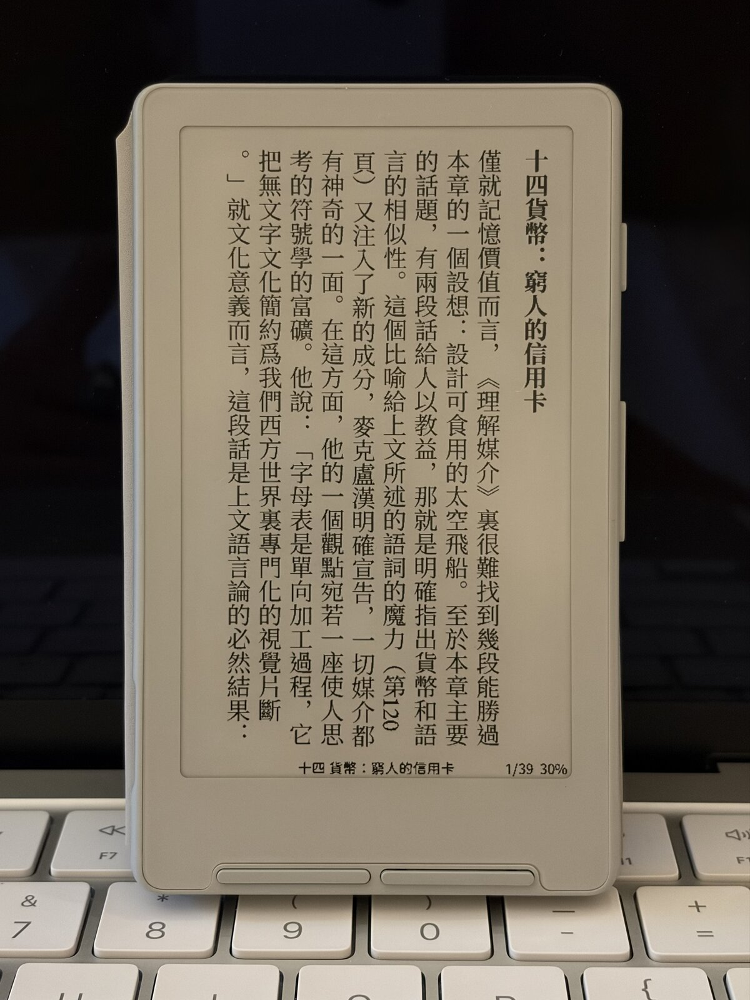

# ryOS CrossMux

[English](./README.en.md) | [中文](./README.md) | [日本語](./README.ja.md) | **한국어**

**ryOS CrossMux**는 Xteink X3 / X4를 위한 '읽기 우선' 펌웨어입니다.
[CrossMux](https://github.com/0x1abin/crossmux)의 포크이며,
[CrossPoint Reader](https://github.com/crosspoint-reader/crosspoint-reader)를 기반으로 합니다.

이 포크는 한국어·중국어·일본어(CJK) 도서에 집중합니다: 세로쓰기 EPUB 레이아웃, 넓은 글자 커버리지, 안정적인 SD 카드 글꼴, 그리고 더 빠른 4단계 그레이스케일 텍스트 렌더링. 읽기 통계와 대기 화면은 유지하고, 기존의 게임·토이 앱은 펌웨어에서 제외했습니다.

**현재 펌웨어 버전:** 1.4.7



## 이 포크가 추가하는 것

### 세로쓰기 CJK EPUB 읽기

리더 설정 또는 책 내부 메뉴에서 `쓰기 방향 > 세로쓰기 (오른쪽에서 왼쪽)`를 선택하면 레이아웃 엔진이:

- 단을 오른쪽에서 왼쪽으로 배치
- CJK 문장 부호에 세로쓰기 표현형 사용
- 반복되는 줄임표·대시를 한 칸씩 세로로 연결
- 로마자 구간을 회전하되 짧은 숫자는 읽기 쉽게 유지
- 문단 간격과 블록 여백을 단 축을 따라 적용
- 페이지 넘김 버튼을 읽기 방향에 맞춰 반전

세로쓰기는 EPUB 언어 메타데이터가 중국어·일본어·한국어로 표시된 경우에만 활성화됩니다. 그 외의 책은 전역 설정이 세로쓰기여도 가로쓰기로 표시됩니다.

### 한국어 펌웨어

국제판·중국어판에 더해 일본어 / 한국어 SKU를 제공합니다:

| 환경 | 로캘 | UI | OTA 에셋 |
| --- | --- | --- | --- |
| `gh_release_ja` | `ja-JP` | 일본어 | `firmware-ja.bin` |
| `gh_release_ko` | `ko-KR` | 한국어 | `firmware-ko.bin` |

한국어 SKU의 내용:

- 첫 부팅 시 UI 언어는 한국어 (영어 + 한국어 UI 내장)
- 내장 CJK 비트맵 글꼴은 **Resource Han Rounded KR** Regular
- 간체자⇔번체자 변환(OpenCC)은 **하지 않습니다** — 한국어 표기를 그대로 표시합니다
- `ryokun6/crossmux`에서 듀얼 슬롯 OTA (`firmware-ko.bin` 자동 선택)

글자 커버리지는 포인트 크기별로 단계화되어 있습니다:

| 크기 | 수록 내용 | 출처 |
| --- | --- | --- |
| 14pt (기본 '보통') | 현대 한글 음절 **전체 11,172자** + 기초 한자 1,800자 + UI 글자 + EPUB 기호 | 한글 음절 블록 + 한문 교육용 기초 한자 |
| 8/10/12/16/18pt | UI 글자 + 현대 자모만 | — |

옛한글(옛 자모)은 수록하지 않습니다. 자세한 내용은
[docs/engineering/japanese-korean-build.md](./docs/engineering/japanese-korean-build.md)를 참고하세요.

### 더 나은 SD 카드 글꼴

`.cpfont` 글꼴 패밀리는 SD 카드의 `/.fonts/` 또는 `/fonts/`에 넣을 수 있습니다. 로더는 대형 CJK 패밀리를 필요할 때 색인하고, 다음 페이지의 글리프를 미리 준비하며, CJK 굵게·기울임 글리프가 없으면 Regular로 대체합니다.

변환 명령, 유니코드 프리셋, CJK 글꼴 빌더는 [SD-card fonts](./docs/sd-card-fonts.md)에 정리되어 있습니다.

### 더 빠른 그레이스케일 텍스트

글자 안티앨리어싱은 디스플레이의 4단계 그레이스케일을 사용합니다. 이 포크는 두 개의 그레이스케일 평면을 좁은 스트립 단위로 렌더링해 디스플레이에 바로 기록하므로, RAM에 전체 화면 버퍼 두 장을 추가로 유지하지 않습니다.

### 더 단출한 앱 메뉴

펌웨어에는 읽기 관련 앱만 내장되어 있습니다:

- OPDS 브라우저
- 읽기 통계 (기록·히트맵·프로필·업적)
- 대기 화면 (Sloppy Clock, AirPage 등)

스도쿠·오목·지뢰찾기·2048·샹치·라이프 게임·아바타 생성기는 의도적으로 제외했습니다.

## 리더 기능

ryOS CrossMux는 업스트림 CrossPoint의 주요 기능을 유지합니다: EPUB 2/3 렌더링, 챕터 탐색, 각주, 책갈피, 퍼센트 이동, 내장 스타일, 이미지, 커닝, 하이픈 연결, 집중 읽기, 자동 페이지 넘김, 화면 방향 제어, 스크린샷, QR 표시, KOReader 진행률 동기화, `.epub` / `.txt` / `.xtc` / `.xtch` / `.bmp` 지원.

무선 기능으로는 파일 전송, EPUB Optimizer, 웹 설정, WebSocket 업로드, WebDAV, Calibre 무선 연결, OPDS, 그리고 최신 `ryokun6/crossmux` GitHub Release에서의 네트워크 OTA가 있습니다. OTA는 설치된 빌드에 맞춰 `firmware.bin` / `firmware-ko.bin` 등을 자동 선택합니다. USB, 웹 플래셔, 'SD 카드 펌웨어 업데이트'로도 설치할 수 있습니다.

## X3 / X4 지원

하나의 펌웨어 이미지가 두 기기 모두에서 동작합니다. 부팅 시 하드웨어를 감지해 패널 크기·버튼·배터리·주변 장치를 자동으로 조정합니다. 자세한 내용은 [device variants](./docs/engineering/device-variants.md)를 참고하세요.

## 플래시 전 주의 사항

> **USB 잠금 기기 경고**
>
> Xteink Unlocker가 공식 지원하는 것은 CrossPoint와 CrossInk입니다. ryOS CrossMux는 커뮤니티 포크이며, USB가 잠긴 기기에 설치하면 공식 복구 수단을 사용할 수 없게 될 수 있습니다. 검증된 복구 방법이 없다면 잠긴 기기에는 설치하지 마세요.

## 빌드 및 설치

### 준비물

- [pioarduino](https://github.com/pioarduino/pioarduino) 또는 해당 VS Code 확장
- Python 3.8 이상
- submodule을 지원하는 Git
- 데이터 전송이 가능한 USB-C 케이블

### 소스 받기

```bash
git clone --recursive https://github.com/ryokun6/crossmux.git
cd crossmux
```

submodule 없이 클론한 경우:

```bash
git submodule update --init --recursive
```

### 빌드

```bash
# 한국어 펌웨어 (ko-KR)
pio run -e gh_release_ko

# 빌드 후 플래시
pio run -e gh_release_ko -t upload
```

결과물은 `.pio/build/gh_release_ko/firmware.bin`에 생성됩니다.

[CrossPoint web flasher](https://crosspointreader.com/#flash-tools)에서 `Custom .bin`을 선택해 설치할 수도 있습니다.

### CJK 글꼴 재생성 (선택)

문자 집합을 바꾸거나 내장 글꼴을 업데이트할 때만 필요합니다. `ResourceHanRoundedKR-Regular.ttf`([CyanoHao/Resource-Han-Rounded](https://github.com/CyanoHao/Resource-Han-Rounded))를 `lib/EpdFont/builtinFonts/source/ResourceHanRoundedKR/`에 넣은 뒤:

```bash
bash lib/EpdFont/scripts/build-ko-builtin-fonts.sh
```

## 한국어 읽기 참고 사항

제한된 플래시 용량 때문에 다음과 같은 트레이드오프가 있습니다:

- **읽기에는 14pt('보통')를 권장합니다** — 현대 한글 11,172자 전체와 기초 한자 1,800자를 모두 수록한 크기는 14pt뿐입니다. 다른 크기(8/10/12/16/18pt)는 UI 글자만 수록하므로 본문 한글이 □로 표시될 수 있습니다.
- **내장 CJK 글꼴은 한 가지 굵기뿐입니다** — 굵게·기울임은 Regular로 대체됩니다. 다른 굵기가 필요하면 SD 카드 글꼴을 사용하세요.
- **옛한글(옛 자모)은 수록하지 않습니다.**
- **간체자⇔번체자 변환을 하지 않습니다** — 중국어 EPUB을 열면 한국어 서브셋에 없는 한자는 □로 표시될 수 있습니다.
- 세로쓰기는 EPUB 언어 메타데이터(`ko` 등)에 의존합니다.

## 라이선스 및 크레딧

ryOS CrossMux는 [CrossMux](https://github.com/0x1abin/crossmux),
[CrossPoint Reader](https://github.com/crosspoint-reader/crosspoint-reader),
[diy-esp32-epub-reader](https://github.com/atomic14/diy-esp32-epub-reader)의 작업 위에 구축되었습니다.

이 프로젝트는 Xteink 및 어떤 기기 제조사와도 관련이 없습니다.

[MIT License](./LICENSE)로 배포됩니다.
